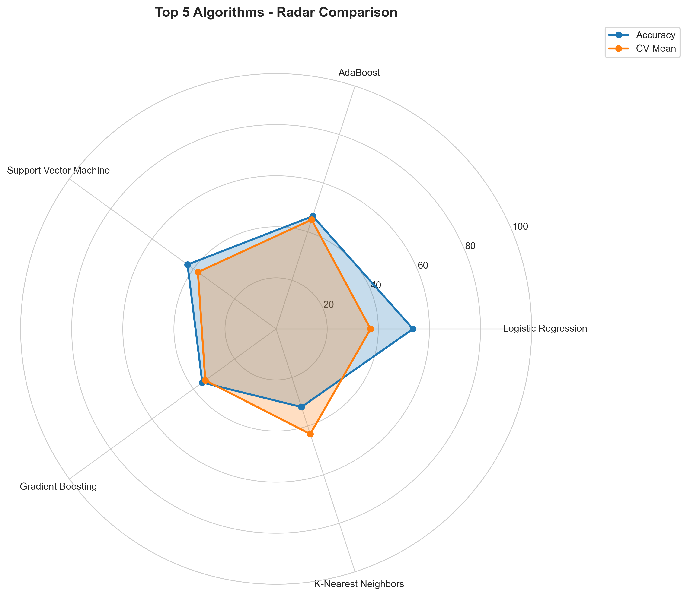
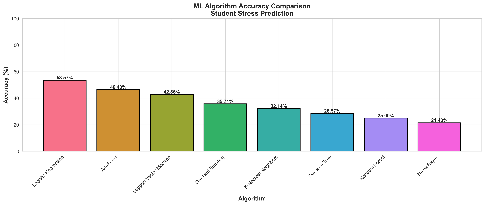

# 🎓 Student Stress Level Prediction | ML-Powered Mental Health Insights


> **"Mental health is not a destination, but a process. It's about how you drive, not where you're going."**

---

## 📋 Project Overview
The **Student Stress Level Prediction** system is a machine learning application designed to analyze and predict the stress levels of students based on various psychological, environmental, and academic factors. By leveraging advanced ML algorithms, this tool provides real-time insights and personalized advice to help students manage their mental well-being effectively.

This project aims to bridge the gap between academic pressure and mental health awareness, offering a data-driven approach to understanding student stress.

---

## ✨ Key Features
- **🔍 Real-Time Prediction**: Instant stress level assessment (Levels 1-5) based on user inputs.
- **🧠 Intelligent Analysis**: Utilizes a trained Machine Learning model to evaluate multiple stress factors.
- **💡 Personalized Advice**: Provides actionable recommendations tailored to the predicted stress level.
- **📊 Comprehensive Reports**: Includes detailed visualizations and analysis of model performance.
- **💻 Interactive Web Interface**: User-friendly Flask application for easy interaction.

---

## 🛠️ Tech Stack
- **Languages**: Python
- **Web Framework**: Flask
- **Machine Learning**: Scikit-Learn, NumPy, Pandas
- **Visualization**: Matplotlib, Seaborn
- **Frontend**: HTML5, CSS3 (Jinja2 Templates)

---

## 📊 Model Performance & Analysis
We extensively compared multiple algorithms to ensure the highest accuracy.

### 🏆 Top Performing Models (Radar Comparison)
We evaluated various models including Random Forest, Gradient Boosting, SVM, and others. The radar chart below highlights the performance metrics of our top contenders.



### 📈 Algorithm Accuracy Comparison
A side-by-side comparison of accuracy across different machine learning algorithms.



---

## 🚀 Installation & Usage

### Prerequisites
- Python 3.x installed
- pip package manager

### Steps
1.  **Clone the Repository**
    ```bash
    git clone https://github.com/ishikadubey1105/Student-Stress-Level-Prediction-using-ML.git
    cd Student-Stress-Level-Prediction-using-ML
    ```

2.  **Install Dependencies**
    ```bash
    pip install -r requirements.txt
    ```

3.  **Run the Application**
    ```bash
    python app.py
    ```

4.  **Access the App**
    Open your browser and navigate to `http://127.0.0.1:5000/`.

---

## 📂 Project Structure
```
├── app.py                     # Main Flask Application
├── model.py                   # Model training script
├── predict.py                 # Prediction logic
├── compare_algorithms.py      # Script to compare ML algorithms
├── generate_report.py         # Generates detailed analysis reports
├── model_enhanced.py          # Enhanced modeling techniques
├── requirements.txt           # Project dependencies
├── templates/                 # HTML templates for the web interface
├── academic Stress level...   # Dataset CSV
└── *.png                      # Generated visualization assets
```

---

## 🤝 Contributing
Contributions are welcome! Please feel free to submit a Pull Request.

1.  Fork the Project
2.  Create your Feature Branch (`git checkout -b feature/AmazingFeature`)
3.  Commit your Changes (`git commit -m 'Add some AmazingFeature'`)
4.  Push to the Branch (`git push origin feature/AmazingFeature`)
5.  Open a Pull Request

---

## 📞 Contact
Project Maintainer: Ishika Dubey
Link: [Project Repository](https://github.com/ishikadubey1105/Student-Stress-Level-Prediction-using-ML)
